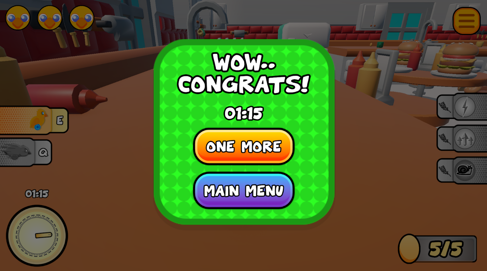

# CikWick: Human-Machine Interaction and Virtual Reality Project

## 0. Installation
This project is a **Unity project** and is intended to be opened and run inside the Unity Editor.  
It was developed using **Unity version 6000.1.1f1** and may not work properly on older versions.

### To run the project:
1. Clone or download the repository:

   ```bash
   git clone https://github.com/haktanpolatt/CikWickGame.git
3. Or [download as ZIP](https://github.com/haktanpolatt/CikWickGame/archive/refs/heads/main.zip) and extract it.
4. Open Unity Hub.
5. Click on Add Project and select the root folder of the project you just downloaded.
6. Make sure you're using Unity 6000.1.1f1. If not installed, add it via Unity Hub.
7. Open the project and press the Play button in the Unity Editor.

⚠️ This project is intended for Windows platform. Make sure your platform target is set to Windows in File > Build Settings.

## 1. Introduction
This project was carried out as an application study of the Human Computer Interaction (HCI)
course. Within the scope of the project, the player is aimed to collect 5 different eggs (easter
eggs) in a level full of interactive elements by controlling a wheeled chick in a kitchen-themed
environment. The game is designed in accordance with HCI principles in terms of visuals,
feedback, user control and variety of interactions. The project, which is aimed to be both
entertaining and educational, has been shaped by focusing on user experience throughout the
game design process.

## 2. Game Description and Basic Mechanics
### 2.1 Main Menu and Transitions
The player is welcomed to the game on the opening screen. The main menu features a visual
background of a happily jumping chick, visually generated by ChatGPT. There are two buttons in
this scene:
- Play: Starts the game.
- Quit: Quits the game.

When the Play button is pressed, the game scene is switched to with a smooth and visually
pleasing transition effect using the asset package called Mask Transitions developed by
Nearmint Studios.


### 2.2 Controls and Gameplay Modes
The player guides the chick with the WASD keys. There are two different movement modes
throughout the game:
- Walking Mode: Medium-speed, more controlled movement.
- Sliding Mode: Faster, momentum-driven movement.

These two modes can be switched between with the Q and E keys. The activity of both modes is
visualized by the bars shown to the user on the screen.
### 2.3 Game Content and Objective
The game scene has a kitchen theme. The chick collects 5 different colored Easter eggs in this
kitchen. The counter in the bottom right corner of the screen is updated with each egg collected.
When all the eggs are collected, the game stops and the winning screen appears.
The player has interactions with wheat types that provide three different properties:
- Gold Wheat: Provides a speed boost.
- Holy Wheat: Increases jump height.
- Rotten Wheat: Decreases speed.

When boosts are received, the colors on the indicator bars on the right side of the screen change
from gray to yellow, allowing the user to receive instant feedback.
The player can also interract with the spatulas around the edges of the counter and when you
step on these spatulas, they launch you into the air.


### 2.4 User Interface (UI)
While the game is being played, there are indicators in different areas of the screen that provide
information to the user:
- Top Left: Number of lives (3 in total).
- Bottom Left: Duration and timer.
- Top Right: Pause menu.
- Bottom Right: Collected egg counter (out of 5).
- Right Side: Boost activity indicator.
- Left Side: Movement mode indicator (walk/slide).


### 2.5 End of Game Screens
- Win Status: When all eggs are collected, the game stops and a popup with the theme
"You won" appears on the screen. This screen shows the player's finishing time. There
are also two buttons:
  - Replay
  - Return to Main Menu
- Lose Condition: Currently inactive but prepared. For example, this screen can be
triggered in the future when health is reset or when an enemy (e.g. cat) is caught.


## 3. Asset and Resources Used
- Chick Model: Taken from a YouTube creator.
- Kitchen Environment: KayKit – Restaurant Bits
- Sky: Free Stylized Skybox by Yuki2022
- Font: Toon Cats (free for personal/student use)
- Animations: DOTween (HOTween v2) by Demigiant
- Transition Animation: Mask Transitions by Nearmint Studios
- Unity Editor Help: FolderColor by Nyukiland – used to facilitate editing of project files.

## 4. Development Process
### 4.1 Design
The game idea was developed based on the basic components of HCI: intuitive control,
feedback, user guidance, and simple interface. Multiple interactive modes, such as the chick’s
sliding/walking transition, provided the player with different movement dynamics, creating a
more active interaction area.
### 4.2 Implementation and Organization
The game mechanics were developed using Unity with Rigidbody, Collider, and OnTriggerEnter
structures. File organization has been improved with the FolderColor asset to provide an
organized work environment outside of the game.
### 4.3 Testing and Feedback
The game was tested by several users and feedback was received. It was reported that the
controls were intuitive and the boost bars were understandable. It was suggested that the
difficulty elements (fire, enemies) be increased in the future.

## 5. Future Development Plans
- Difficulty Mechanics: The fire from the stove can kill you, a cat wandering around the
kitchen can be added as an enemy.
- Score System: A star system or leaderboard can be added according to record times.
- Voice and Feedback: Sound effects for boosts, narration in losing/winning moments
can be added.

## 6. Assessment of Compliance with HCI Principles
| Principle         | Implementation                                                                 |
|-------------------|---------------------------------------------------------------------------------|
| Feedback          | Provided with boost bars, visual transitions, time indicators.                 |
| User Control      | Free to switch between walking/sliding. Full control with WASD.               |
| Recognizability   | Clear mode and boost information thanks to color coding and bars.             |
| Consistency       | Interface and controls remain unchanged throughout the game.                  |
| Error Management  | Lose screen not yet active but system ready. May be added in the future.      |

## 7. Conclusion
This project aimed to create a user-centered experience in terms of Human Computer
Interaction, beyond developing a game in the Unity environment. This game, which was
developed by taking into account the user's feedback, sense of control and motivation, provided
both an entertaining experience and allowed me to test HCI design principles in practice as a
developer.

## 8. For Your Testing
In order to test my project more easily, you can find the locations of the eggs and the wheats on
the map in the image below.


- S = Spatulas: Launch you into the air for accessing to the tables and chairs.
- Wheats
  - G = Gold: On the counter
  - R = Rotten: On the floor
  - H = Holy: On the chair
- Eggs
  - 1-2-3-5: On the counter
  - 4: On the floor
